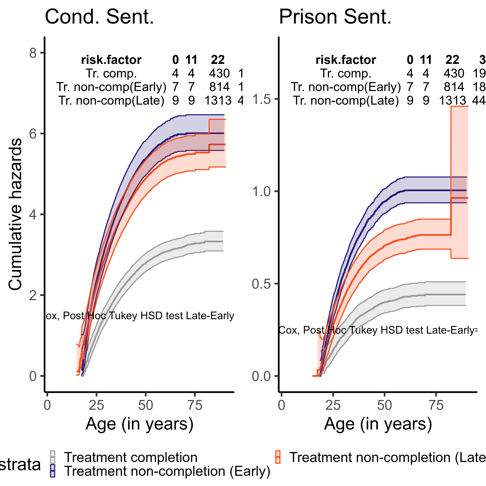

<!---
#https://github.com/brentthorne/posterdown/wiki/posterdown_betterport
#despues de number_section
#knit: pagedown::chrome_print
#https://docs.google.com/document/d/1O9_FGXL4jDPn19yp4Pb6y0w0BZtbocMK90ee8Gz3FNg/edit#
#bibliography: ./_bibs/libreria_generica.bib
#link-citations: true
--->

```{css, echo=FALSE}
div.title_container{
   background-color: #21177A;
}

div.logo_left{
  background-color: #ff7f50;
}
div.logo_right{
  background-color: #ff7f50;
}

:root {
  --text-bold-color: #21177A;
}

```

```{=html}
<style type="text/css">
.showopt {   
  background-color: #004c93;   color: #FFFFFF;    width: 100px;   height: 20px;   text-align: center;   vertical-align: middle !important;   float: right;   font-family: sans-serif;   border-radius: 8px; 
  }

.showopt:hover {     
        background-color: #dfe4f2;
        color: #004c93; 
        }  
pre.plot {   
        background-color: white !important; 
        } 
.tablelines table, .tablelines td, .tablelines th {
        border: 1px solid black;
        }

.centrado {
    text-align: center;
}

.table.center {
    margin-left:auto; 
    margin-right:auto;
  }

/* https://vivekjaiskumar.medium.com/css-is-and-not-selector-17c942ec83f :is()*/

/* Applies to outputs that are not code other than R*/

pre {
  overflow-x: auto !important;
}
pre code {
  word-wrap: normal !important;
  white-space: pre !important;
}
/*
pre:not(.sourceCode) { 
  white-space: nowrap !important;
}
*/
.sourceCode { /* Important gives precedence  */
  font-size: 10px !important;
  line-height: 50% !important;
}

.text_38 { /* Important gives precedence  */
  font-size: 38% !important;
}

.text_40 { /* Important gives precedence  */
  font-size: 40% !important;
}

.text_50 { /* Important gives precedence  */
  font-size: 50% !important;
}

.text_55 { /* Important gives precedence  */
  font-size: 55% !important;
}

.text_60 { /* Important gives precedence  */
  font-size: 60% !important;
}

.text_65 { /* Important gives precedence  */
  font-size: 65% !important;
}

.text_70 { /* Important gives precedence  */
  font-size: 70% !important;
}

.text_75 { /* Important gives precedence  */
  font-size: 75% !important;
}

body{ /* Normal  */
      text-align: justify;
  }

.superbigimage{
    overflow-y:scroll;
    height:350px;
    white-space: nowrap;
    overflow-x: auto; 
    width:100%;
}
.superbigimage img{
    overflow-y: scroll;
    overflow-x: hidden;
}

.message { color:#446C6E; font-family: monospace;font-size: 10px; line-height: 110%; font-weight: bold;}
div.blue { background-color:#e6f0ff; border-radius: 5px; padding: 5px; text-align: justify;}
div.red { background-color:#e6bab1; border-radius: 5px; padding: 5px; text-align: justify;}

.pandoc-table { /* Should add !important; but it seems no necessary  */
  margin-left:auto; /* To center */
  margin-right:auto;
  border-collapse: collapse;
  table-layout: auto;
  font-size: 7px;
  overflow-y: auto;
  max-height:450px !important;
  white-space: nowrap;
  overflow-x: auto; 
  width:450px;
}

.pandoc-table th {/* header */
text-align: center !important;
font-size: 7px;
padding: 0px;
}

.pandoc-table td {
text-align: left !important;
font-size: 6px;
padding: 0px;
}

.pandoc-table caption {
    text-align: left !important;
    font-size: 11px !important;
}

.controlly{
    overflow-y:scroll;
    height:350px;
    overflow-x: scroll; 
}

</style>


<style>
.showopt {
  background-color: #004c93;
  color: #FFFFFF; 
  width: 100px;
  height: 20px;
  text-align: center;
  vertical-align: middle !important;
  float: right;
  font-family: sans-serif;
  border-radius: 8px;
}

.showopt:hover {
    background-color: #dfe4f2;
    color: #004c93;
}

pre.plot {
  background-color: white !important;
}
</style>
```

```{js hideOutput, echo=F}
$(document).ready(function() {    
	$chunks = $('.fold');    
	$chunks.each(function () {      // add button to source code chunks     
	if ( $(this).hasClass('s') ) {       
		$('pre.r', this).prepend("<div class=\"showopt\">Show Source</div><br style=\"line-height:22px;\"/>");
       		$('pre.r', this).children('code').attr('class', 'folded');     
       		}      // add button to output chunks     
		if ( $(this).hasClass('o') ) {       
			$('pre:not(.r)', this).has('code').prepend("<div class=\"showopt\">Show Output</div><br style=\"line-height:22px;\"/>");       
			$('pre:not(.r)', this).children('code:not(r)').addClass('folded');        // add button to plots       
			$(this).find('img').wrap('<pre class=\"plot\"></pre>');       
			$('pre.plot', this).prepend("<div class=\"showopt\">Show Plot</div><br style=\"line-height:22px;\"/>");       
			$('pre.plot', this).children('img').addClass('folded');      
			}   
});    // hide all chunks when document is loaded   
	$('.folded').css('display', 'none')    // function to toggle the visibility   
	$('.showopt').click(function() {     
			var label = $(this).html();     
			if (label.indexOf("Show") >= 0) {       
				$(this).html(label.replace("Show", "Hide"));     
			} else {
			  $(this).html(label.replace("Hide", "Show"));     
			}     
	$(this).siblings('code, img').slideToggle('fast', 'swing');   
	}); 
}); 
```


```{r prev-setup, include = FALSE, cache=T, error=T}
rm(list=ls());gc()

#If you render multiple documents from the same script or R session, you should detach("Statamarkdown") in between documents.
try(detach("Statamarkdown"))

if(!grepl("4.1.2",R.version.string)){stop("Different version (must be 4.1.2)")}
path<-getwd()#we define it again later in setup chunk
if (grepl("CISS Fondecyt",path)==T){
    try(setwd("C:/Users/CISS Fondecyt/Mi unidad/Alvacast/SISTRAT 2022 (github)"));load("C:/Users/CISS Fondecyt/Mi unidad/Alvacast/SISTRAT 2022 (github)/14.Rdata")
  } else if (grepl("andre",path)==T){
    try(setwd('C:/Users/andre/Desktop/SUD_CL/'));load("E:/Mi unidad/Alvacast/SISTRAT 2022 (github)/14.Rdata")
  } else if (grepl("E:",path)==T){
    try(setwd("E:/Mi unidad/Alvacast/SISTRAT 2022 (github)/SUD_CL/"));load("E:/Mi unidad/Alvacast/SISTRAT 2022 (github)/14.Rdata")
  } else {
    try(setwd(paste0(path)));load(paste0(gsub("SUD_CL","",gsub("2022","2019",path)),"/14.Rdata"))
  }
```


```{r setup, include = FALSE, cache=T, error=T, echo=T}
#Libraries used in the routine. Dont change the order
local({r <- getOption("repos")
       r["CRAN"] <- "http://cran.r-project.org" 
       options(repos=r)
})
copiar_nombres <- function(x,row.names=FALSE,col.names=TRUE,dec=",",...) {
  if(class(try(dplyr::ungroup(x)))[1]=="tbl_df"){
        if(options()$OutDec=="."){
            options(OutDec = dec)
            write.table(format(data.frame(x)),"clipboard",sep="\t",row.names=FALSE,col.names=col.names,...)
            options(OutDec = ".")
          return(x)
        } else {
            options(OutDec = ",")
            write.table(format(data.frame(x)),"clipboard",sep="\t",row.names=FALSE,col.names=col.names,...)
            options(OutDec = ",")
          return(x)    
        }
  } else {
        if(options()$OutDec=="."){
            options(OutDec = dec)
            write.table(format(x),"clipboard",sep="\t",row.names=FALSE,col.names=col.names,...)
            options(OutDec = ".")
          return(x)
        } else {
            options(OutDec = ",")
            write.table(format(x),"clipboard",sep="\t",row.names=FALSE,col.names=col.names,...)
            options(OutDec = ",")
          return(x)       
  }
 }
}  
pacman::p_unlock(lib.loc = .libPaths()) #para no tener problemas reinstalando paquetes

if(!require(pacman)){install.packages("pacman")}
if(!require(devtools)){install.packages("devtools", type = "win.binary", dependencies=T)}

pacman::p_load(APCtools, ggpattern, withr, boot, matrixStats, knitr, tidyr, stringi,stringr, ggplot2, Hmisc, kableExtra, plotly, janitor, rbokeh, zoo, broom, sqldf, devtools, codebook, data.table, panelr, RColorBrewer, lsmeans, finalfit, ggiraph, sf, treemapify, dplyr, tidyverse, epiR, survminer, ggfortify, survMisc, foreign, reshape2, stargazer, tableone, MatchIt, cobalt, eha, igraph, Amelia, DiagrammeR, DiagrammeRsvg, rsvg, mstate, htmltools, webshot, flexsurv, muhaz, Metrics, rpivotTable, caret, polycor, ClusterR, flextable, ggstatsplot, ggside, daff, explore, sjPlot, compareGroups, job, missForest, showtext, ggpattern, distill, showtext, googleVis, tidylog, magick, dlookr, easystats, tidylog, sqldf,  adjustedCurves, ggpmisc, rms, rateratio.test, install=T)

#Error in if (options$noisey == TRUE) message(paste("\n", options$engine, : argument is of length zero


if(!require(survcomp)){try(devtools::install_github("bhklab/survcomp",upgrade ="never"))}

try(webshot::install_phantomjs())

if(!require(bpmn)){try(devtools::install_github("bergant/bpmn",upgrade ="never"))}

#if(!require(Statamarkdown)){try(devtools::install_github("Hemken/Statamarkdown",upgrade ="never"))}
# #Error in if (options$noisey == TRUE) message(paste("\n", options$engine,  : 
#   argumento tiene longitud cero
# Calls: <Anonymous> ... sew.list -> lapply -> FUN -> sew.character -> <Anonymous>

#easystats::install_suggested()

options(scipen=2) #display numbers rather scientific number

#remotes::install_github("chjackson/flexsurv-dev", upgrade = "never")
#devtools::install_github("hputter/mstate", upgrade = "never")

#:#:#:#:#:#:#:#:#:#:#:#:#:#:#:#:#:#:#:#:#:#:#:#:#:#:#:#:#:#:#:#:#:#:#:#:#:#:#:#:#:#:#:#:#:#:#:#:#:#:#:#:#:#:#:
#:#:#:#:#:#:#:#:#:#:#:#:#:#:#:#:#:#:#:#:#:#:#:#:#:#:#:#:#:#:#:#:#:#:#:#:#:#:#:#:#:#:#:#:#:#:#:#:#:#:#:#:#:#:#:

fitstats.flexsurvreg = function(x){
  ll = x$loglik
  aic = x$AIC
  k = length(x$coefficients)
  n = sum(x$data$m["(weights)"])
  aicc = aic + ((2 * k) * (k + 1) / (n - k - 1))
  bic = - 2 * ll + (k * log(n))
  data.frame(
   Df = k,
    "n2ll" = -2 * ll,
    AIC = aic,
    AICc = aicc,
    BIC = bic
  )
}
#:#:#:#:#:#:#:#:#:#:#:#:#:#:#:#:#:#:#:#:#:#:#:#:#:#:#:#:#:#:#:#:#:#:#:#:#:#:#:#:#:#:#:#:#:#:#:#:#:#:#:#:#:#:#:
#:#:#:#:#:#:#:#:#:#:#:#:#:#:#:#:#:#:#:#:#:#:#:#:#:#:#:#:#:#:#:#:#:#:#:#:#:#:#:#:#:#:#:#:#:#:#:#:#:#:#:#:#:#:#:


if(.Platform$OS.type == "windows") withAutoprint({
  memory.size()
  memory.size(TRUE)
  memory.limit()
})
memory.limit(size=56000)

path<-dirname(rstudioapi::getSourceEditorContext()$path)

options(knitr.kable.NA = '')

#:#:#:#:#:#:#:#:#:#:#:#:#:#:#:#:#:#:#:#:#:#:#:#:#:#:#:#:#:#:#:#:#:#:#:#:#:#:#:#:#:#:#:#:#:#:#:#:#:#:#:#:#:#:#:
#:#:#:#:#:#:#:#:#:#:#:#:#:#:#:#:#:#:#:#:#:#:#:#:#:#:#:#:#:#:#:#:#:#:#:#:#:#:#:#:#:#:#:#:#:#:#:#:#:#:#:#:#:#:#:

#to format rows in bold
format_cells <- function(df, rows ,cols, value = c("italics", "bold", "strikethrough")){

  # select the correct markup
  # one * for italics, two ** for bold
  map <- setNames(c("*", "**", "~~"), c("italics", "bold", "strikethrough"))
  markup <- map[value]  

  for (r in rows){
    for(c in cols){

      # Make sure values are not factors
      df[[c]] <- as.character( df[[c]])

      # Update formatting
      df[r, c] <- ifelse(nchar(df[r, c])==0,"",paste0(markup, gsub(" ", "", df[r, c]), markup))
    }
  }

  return(df)
}
#To produce line breaks in messages and warnings
knitr::knit_hooks$set(
   error = function(x, options) {
     paste('\n\n<div class="alert alert-danger">',
           gsub('##', '\n', gsub('^##\ Error', '**Error**', x)),
           '</div>', sep = '\n')
   },
   warning = function(x, options) {
     paste('\n\n<div class="alert alert-warning">',
           gsub('##', '\n', gsub('^##\ Warning:', '**Warning**', x)),
           '</div>', sep = '\n')
   },
   message = function(x, options) {
     paste('<div class="message">',
           gsub('##', '\n', x),
           '</div>', sep = '\n')
   }
)

 
irrs<-function(x, y="event", z="person_days",db){
  #x= variable que agrupa
  #y= evento explicado
  #z= person days
  #db= base de datos
  fmla <- as.formula(paste0(y,"~",x))
  fmla2 <- as.formula(paste0(z,"~",x))
assign(paste0("irr_",y,"_por_",x),
       rateratio.test::rateratio.test(
     x=as.numeric(xtabs(fmla, data=get(db)))[c(2,1)],
     n=as.numeric(xtabs(fmla, data=get(db)))[c(2,1)]
    )
   )
return(
  rateratio.test::rateratio.test(
     x=as.numeric(xtabs(fmla, data=get(db)))[c(2,1)],
     n=as.numeric(xtabs(fmla2, data=get(db)))[c(2,1)]
      )
    )
}
```

```{r, include=FALSE}
knitr::opts_chunk$set(echo = FALSE,
                      warning = FALSE,
                      tidy = FALSE,
                      message = FALSE,
                      fig.align = 'center',
                      out.width = "100%")
options(knitr.table.format = "html") 
```


```{r, load_refs, include=F, cache=FALSE}
library(RefManageR)
BibOptions(check.entries = FALSE,
           bib.style = "numeric",
           cite.style = "numeric",
           style = "markdown",
           super = TRUE,
           hyperlink = FALSE,
           dashed = FALSE)

myBib <- ReadBib("_bibs/libreria_generica.txt", check = F,  .Encoding="latin1")
```

# Background

Extensive research has shown that reducing substance abuse through effective treatment leads to a reduction in criminal activity$`r Cite(myBib, c("prendergast2006"))`$. However, most of this evidence comes from developed countries, and results from the Latin American context are largely unknown$`r Cite(myBib, c("klingemann2020"))`$. The structural, economic, epidemiological context and substance use treatment (SUT) policy response are different in this region, making the question about SUT effectiveness through locally based data relevant$`r Cite(myBib, c("Mateo_Pinones2022"))`$. 

## Objectives

We analyse Chile as a case study and examine the impact of SUT on the prevention of contact with the criminal justice system in the short (3 and 6 months), middle (1 year), and long term (3 years). 

# Methods

This research relies on a population-based record-linkage retrospective cohort design. We used a deterministic linkage process (using encryption of the Chilean Unique National ID) to merge electronic records of individuals in publicly funded Chilean SUT programs with the Prosecutor’s Office data at the national level between 2010 and 2019.

We described the cumulative incidence rate  and incidence rate ratio of offenses that ended with a condemnatory sentence and of offenses that ended with imprisonment after baseline treatment outcome, and its variation by baseline treatment outcome: Treatment completion, Late Discharge (>= 3months) Early Discharge (withdraw within the first 3 months of treatment. 

Posteriorly, we aim to calculate the association between Baseline treatment outcome and Contact with justice system through flexible Royston-Parmar models while adjusting for several covariates, as well as using a 2-step inverse probability weigthing Royston-Parmar survival regression and adjusting for covariates$`r Cite(myBib, c("s457128"))`$.

Mentioned analyses are depicted in the following equations:

::: text_40

$$
\begin{eqnarray*}
ln(H(t)|x_i)_{offense\,judged\,with\,condemnatory\,sentence}=s(ln(t)|\eta,k_0)+ Bx_i \\
\\
\end{eqnarray*}
$$

$$
\begin{eqnarray*}
ln(H(t)|x_i)_{offense\,judged\,with\,prison\,sentence}=s(ln(t)|\eta,k_0)+ Bx_i \\
where\ x\hat{\beta}_i= \\
& & \mathrm{Treatment\ non-completion\ (Early)} \\
& & \mathrm{Treatment\ non-completion\ (Late)} \\
& & \mathrm{Age\ at\ admission\ to\ treatment} \\
& & \mathrm{Educational\ attainment} \\
& & \mathrm{Substance\ Use\ Onset} \\
& & \mathrm{Primary\ Substance\ At\ Admission} \\
& & \mathrm{Primary\ Substance\ at\ Admission\ Usage\ Frequency} \\
& & \mathrm{Psychiatric\ Comorbidity} \\
& & \mathrm{Biopsychosocial\ Compromise} \\
& & \mathrm{Number\ of\ children} \\
& & \mathrm{Substance\ use\ severity} \\
& & \mathrm{Number\ of\ previous\ offenses\ (violent)} \\
& & \mathrm{Number\ of\ previous\ offenses\ (acquisitive)} \\
& & \mathrm{Number\ of\ previous\ offenses\ (SUD)} \\
\\
\end{eqnarray*}
$$

<!----
# https://diagnprognres.biomedcentral.com/articles/10.1186/s41512-018-0026-5
---->

:::

# Preliminary Results

Of the `r format(nrow(CONS_C1_df_dup_SEP_2020_22_d), big.mark=",")` SENDA patients,  `r format(nrow(Base_fiscalia_v13), big.mark=",")` (`r scales::percent(nrow(Base_fiscalia_v13)/nrow(CONS_C1_df_dup_SEP_2020_22_d))`) were eligible to be matched with the Prossecutor's Office database. Of the sample, `r format(nrow(dplyr::filter(Base_fiscalia_v13, !is.na(dateofbirth_imp))), big.mark=",")` (`r scales::percent(nrow(dplyr::filter(Base_fiscalia_v13, !is.na(dateofbirth_imp)))/nrow(Base_fiscalia_v13))`) had at least an offense that ended with a condemnatory sentence after baseline treatment. Those that had at least an offense that ended with imprisonment after baseline treatment were `r format(nrow(dplyr::filter(Base_fiscalia_v13_pris, !is.na(dateofbirth_imp))), big.mark=",")` (`r scales::percent(nrow(dplyr::filter(Base_fiscalia_v13_pris, !is.na(dateofbirth_imp)))/nrow(Base_fiscalia_v13_pris))`).

<div class="fold s o">

```{r exp-surv1, eval=T, echo=F, error=T, fig.align='center', message=FALSE, warning=FALSE}
library(tidyverse)
dplyr::bind_rows(
data.table::data.table(biostat3::survRate(Surv((age_offending_imp- edad_al_egres_imp), !is.na(dateofbirth_imp)) ~ motivodeegreso_mod_imp_rec, data= dplyr::filter(Base_fiscalia_v13,age_offending_imp- edad_al_egres_imp>=0))  %>% select(-1) %>%  dplyr::mutate_at(c("rate", "lower", "upper"),~round(.*1000,0)), keep.rownames=T),
data.table::data.table(biostat3::survRate(Surv((age_offending_imp- edad_al_egres_imp), !is.na(dateofbirth_imp)) ~ 1, data= dplyr::filter(Base_fiscalia_v13,age_offending_imp- edad_al_egres_imp>=0))  %>% dplyr::mutate_at(c("rate", "lower", "upper"),~round(.*1000,0)), keep.rownames = T) %>% dplyr::mutate(rn="Total"))%>% 
  as.data.frame() %>% 
  dplyr::mutate(rn= dplyr::case_when(grepl("Treatment completion",rn)~"Tr. Comp",grepl("Early",rn)~"Early Dis",grepl("Late",rn)~"Late Dis", T~"Total")) %>% 
  dplyr::mutate(tstop= round(tstop, 0)) %>% 
  format_cells(4, 1:length(names(.)), "bold") %>%
  knitr::kable("markdown", size=3, col.names= c("Outcome", "Person-time","Event", "Rate", "LoCI95%", "UpCI95%"), caption= "Offending with condemnatory sentence from Baseline Treatment Outcome (x1000 person-years)")
```

</div>

<br>

<br>

```{r exp-surv2, eval=T, echo=F, error=T, fig.align='center', message=FALSE, warning=FALSE}
Base_fiscalia_v13_comp<-
Base_fiscalia_v13 %>% 
  dplyr::mutate(mot_egres_latewdl=dplyr::case_when(grepl("Late",motivodeegreso_mod_imp)~"1.Late WDRL",
                                                        grepl("Therap",motivodeegreso_mod_imp)~"0.Therapeutic Disch.",TRUE~NA_character_)) %>% 
  dplyr::mutate(mot_egres_latewdl= factor(mot_egres_latewdl)) %>% 
  dplyr::mutate(mot_egres_earlywdl=dplyr::case_when(grepl("Early",motivodeegreso_mod_imp)~"1.Early WDRL",
                                                        grepl("Therap",motivodeegreso_mod_imp)~"0.Therapeutic Disch.",TRUE~NA_character_)) %>% 
  dplyr::mutate(mot_egres_earlywdl= as.factor(mot_egres_earlywdl)) %>% 
  dplyr::mutate(mot_egres_earlywdl_late=dplyr::case_when(grepl("Early",motivodeegreso_mod_imp)~"1.Early WDRL",
                                                        grepl("Late",motivodeegreso_mod_imp)~"0.Late WDRL",TRUE~NA_character_)) %>% 
  dplyr::mutate(mot_egres_earlywdl_late= as.factor(mot_egres_earlywdl_late)) %>% 
  dplyr::mutate(event= ifelse(!is.na(dateofbirth_imp),1,0)) %>% 
  dplyr::mutate(timetoevent= age_offending_imp- edad_al_egres_imp) %>% 
  ungroup()
Base_fiscalia_v13_pris_comp<-
Base_fiscalia_v13_pris %>% 
  dplyr::mutate(mot_egres_latewdl=dplyr::case_when(grepl("Late",motivodeegreso_mod_imp)~"1.Late WDRL",
                                                        grepl("Therap",motivodeegreso_mod_imp)~"0.Therapeutic Disch.",TRUE~NA_character_)) %>% 
  dplyr::mutate(mot_egres_latewdl= factor(mot_egres_latewdl)) %>% 
  dplyr::mutate(mot_egres_earlywdl=dplyr::case_when(grepl("Early",motivodeegreso_mod_imp)~"1.Early WDRL",
                                                        grepl("Therap",motivodeegreso_mod_imp)~"0.Therapeutic Disch.",TRUE~NA_character_)) %>% 
  dplyr::mutate(mot_egres_earlywdl= as.factor(mot_egres_earlywdl)) %>% 
  dplyr::mutate(mot_egres_earlywdl_late=dplyr::case_when(grepl("Early",motivodeegreso_mod_imp)~"1.Early WDRL",
                                                        grepl("Late",motivodeegreso_mod_imp)~"0.Late WDRL",TRUE~NA_character_)) %>% 
  dplyr::mutate(mot_egres_earlywdl_late= as.factor(mot_egres_earlywdl_late)) %>% 
  dplyr::mutate(event= ifelse(!is.na(dateofbirth_imp),1,0)) %>% 
  dplyr::mutate(timetoevent= age_offending_imp- edad_al_egres_imp) %>% 
  ungroup()

irrs_early_drop<-irrs(x="mot_egres_earlywdl", z="timetoevent", y="event", db="Base_fiscalia_v13_comp")
irrs_early_drop_pris<-irrs(x="mot_egres_earlywdl", z="timetoevent", y="event", db="Base_fiscalia_v13_pris_comp")
irrs_early_late_drop<-irrs(x="mot_egres_earlywdl_late", z="timetoevent", y="event", db="Base_fiscalia_v13_comp")
irrs_early_late_drop_pris<-irrs(x="mot_egres_earlywdl_late", z="timetoevent", y="event", db="Base_fiscalia_v13_pris_comp")
irrs_late_drop<-irrs(x="mot_egres_latewdl", z="timetoevent", y="event", db="Base_fiscalia_v13_comp")
irrs_late_drop_pris<-irrs(x="mot_egres_latewdl", z="timetoevent", y="event", db="Base_fiscalia_v13_pris_comp")
```
<div class="fold s o">
```{r exp-surv2-2, eval=T, echo=F, error=T, fig.align='center', message=FALSE, warning=FALSE}
dplyr::bind_rows(
data.table::data.table(biostat3::survRate(Surv((age_offending_imp- edad_al_egres_imp), !is.na(dateofbirth_imp)) ~ motivodeegreso_mod_imp_rec, data= dplyr::filter(Base_fiscalia_v13_pris,age_offending_imp- edad_al_egres_imp>=0))  %>% select(-1) %>%  dplyr::mutate_at(c("rate", "lower", "upper"),~round(.*1000,0)), keep.rownames=T),
data.table::data.table(biostat3::survRate(Surv((age_offending_imp- edad_al_egres_imp), !is.na(dateofbirth_imp)) ~ 1, data= dplyr::filter(Base_fiscalia_v13_pris,age_offending_imp- edad_al_egres_imp>=0))  %>% dplyr::mutate_at(c("rate", "lower", "upper"),~round(.*1000,0)), keep.rownames = T) %>% dplyr::mutate(rn="Total"))%>% 
  as.data.frame() %>% 
  dplyr::mutate(rn= dplyr::case_when(grepl("Treatment completion",rn)~"Tr. Comp",grepl("Early",rn)~"Early Dis",grepl("Late",rn)~"Late Dis", T~"Total")) %>% 
  dplyr::mutate(tstop= round(tstop, 0)) %>% 
  format_cells(4, 1:length(names(.)), "bold") %>%
  knitr::kable("markdown", size=3, col.names= c("Outcome", "Person-time","Event", "Rate", "LoCI95%", "UpCI95%"), caption= "Offending with imprisonment from Baseline Treatment Outcome (x1000 person-years)")
```

</div>

-	Compared to those receiving no treatment (early drop-out), those completing SUT took longer to contact the criminal justice system (IRR [Incidence rate ratio]= `r sprintf("%1.2f", irrs_early_drop$estimate[1])` 95% IC `r sprintf("%1.2f", irrs_early_drop$conf.int[1])`,`r sprintf("%1.2f", irrs_early_drop$conf.int[2])`) and to commit an offence leading to imprisonment `r sprintf("%1.2f", irrs_early_drop_pris$estimate[1])` (95% IC `r sprintf("%1.2f", irrs_early_drop_pris$conf.int[1])`,`r sprintf("%1.2f", irrs_early_drop_pris$conf.int[2])`).

-	Compared to receiving some treatment (late drop-out), those completing SUT took longer (IRR= `r sprintf("%1.2f", irrs_late_drop$estimate[1])` 95% CI  `r sprintf("%1.2f", irrs_late_drop$conf.int[1])`,`r sprintf("%1.2f", irrs_late_drop$conf.int[2])`) to contact the criminal justice system and to commit an offence leading to imprisonment (IRR= `r sprintf("%1.2f", irrs_late_drop_pris$estimate[1])` 95% CI  `r sprintf("%1.2f", irrs_late_drop_pris$conf.int[1])`,`r sprintf("%1.2f", irrs_late_drop_pris$conf.int[2])`). 

-	However, the difference was lower when we compared those who received some treatment with those who no SUT for some period (late drop-out) regarding the time to contact the criminal justice system (IRR= `r sprintf("%1.2f", irrs_early_late_drop$estimate[1])` 95% CI  `r sprintf("%1.2f", irrs_early_late_drop$conf.int[1])`,`r sprintf("%1.2f", irrs_early_late_drop$conf.int[2])`) and imprisonment (IRR= `r sprintf("%1.2f", irrs_early_late_drop_pris$estimate[1])` 95% CI  `r sprintf("%1.2f", irrs_early_late_drop_pris$conf.int[1])`,`r sprintf("%1.2f", irrs_early_late_drop_pris$conf.int[2])`).


```{r exp-surv3-pris, eval=T, include=F, eval=FALSE}
#str(knitr::opts_chunk$get()) 

library(cowplot)
library(gridExtra)
library(coin)

#https://stat.ethz.ch/pipermail/r-help/2009-August/399999.html
#http://archive.bio.ed.ac.uk/jdeacon/statistics/tress9.html
#https://towardsdatascience.com/survival-analysis-in-clinical-trials-log-rank-test-8f1229e7f0f0

model <- coxph(Surv(time2=age_offending_imp, time=edad_al_egres_imp,  !is.na(dateofbirth_imp)) ~motivodeegreso_mod_imp_rec, data=Base_fiscalia_v13) 
model2 <- coxph(Surv(time2=age_offending_imp, time=edad_al_egres_imp,  !is.na(dateofbirth_imp)) ~motivodeegreso_mod_imp_rec, data=Base_fiscalia_v13_pris) 

# define pairwise comparison
glht_rx <- multcomp::glht(model, linfct=multcomp::mcp(motivodeegreso_mod_imp_rec="Tukey"))
smry_rx <- summary(glht_rx)
glht_rx2 <- multcomp::glht(model2, linfct=multcomp::mcp(motivodeegreso_mod_imp_rec="Tukey"))
smry_rx2 <- summary(glht_rx2)

xx <- survobrien(Surv(time2=age_offending_imp, time=edad_al_egres_imp,  !is.na(dateofbirth_imp)) ~factor(motivodeegreso_mod_imp_rec), data=Base_fiscalia_v13) 
xx <- survobrien(Surv(time2=age_offending_imp, time=edad_al_egres_imp,  !is.na(dateofbirth_imp)) ~factor(motivodeegreso_mod_imp_rec), data=Base_fiscalia_v13) 

no_at_risk$risk.factor<- c("Tr. comp.", "Tr. non-comp(Early)", "Tr. non-comp(Late)")
plot_cond_sent<-
fortify(mot_egreso_fit2, fun = "cumhaz") %>% 
  data.frame() %>% 
  ggplot(aes(x=time, y=surv, fill=strata, color=strata, group=strata))+
  geom_step(size=.8)+
  geom_ribbon(aes(ymin = lower, ymax = upper), alpha = .2) +
  theme_classic2(base_size=18)+
  annotate(geom = "table",
           x = 3,
           y = 8,
           label = list(no_at_risk),
           table.theme = ttheme_gtminimal(base_size=13))+ #10 default
  annotate("text", y = 1.5, x = 65, label = "Cox, Post Hoc Tukey HSD test Late-Early= -0.15, p<0.001",
  parse = F)+
  ylab("Cumulative hazards")+ xlab("Age (in years)")+
    scale_fill_manual(values=c("gray60", "#21177A", "#FE4A17"))+
    scale_color_manual(values=c("gray60", "#21177A", "#FE4A17"))+
  theme(legend.position="bottom")+
  theme(legend.key.size = unit(.2, "cm"))+ 
  guides(fill=guide_legend(
                 keywidth=0.1,
                 keyheight=0.1,
                 default.unit="inch"))+
  theme(text = element_text(size=18))+
  ggtitle("Cond. Sent.")+ guides(color = guide_legend(ncol = 2),
                                 fill = guide_legend(ncol = 2))

no_at_risk_pris$risk.factor<- c("Tr. comp.", "Tr. non-comp(Early)", "Tr. non-comp(Late)")
plot_pris<-
fortify(mot_egreso_fit2_pris, fun = "cumhaz") %>% 
    data.frame() %>% 
    ggplot(aes(x=time, y=surv, fill=strata, color=strata, group=strata))+
    geom_step(size=.8)+
    geom_ribbon(aes(ymin = lower, ymax = upper), alpha = .2) +
      theme_classic2(base_size=18)+
    annotate(geom = "table",
             x = 3,
             y = 1.75,
             label = list(no_at_risk),
             table.theme = ttheme_gtminimal(base_size=13))+ #10 default
    annotate("text", y = .25, x = 65, label = "Cox, Post Hoc Tukey HSD test Late-Early= -0.30, p<0.001",
    parse = F)+  
    ylab(NULL)+ xlab("Age (in years)")+
    scale_fill_manual(values=c("gray60", "#21177A", "#FE4A17"))+
    scale_color_manual(values=c("gray60", "#21177A", "#FE4A17"))+
  theme(legend.position="bottom")+
  theme(text = element_text(size=18))+
  ggtitle("Prison Sent.")

g_legend<-function(a.gplot){
  tmp <- ggplot_gtable(ggplot_build(a.gplot))
  leg <- which(sapply(tmp$grobs, function(x) x$name) == "guide-box")
  legend <- tmp$grobs[[leg]]
  return(legend)}

mylegend<-g_legend(plot_cond_sent)

p3 <- grid.arrange(arrangeGrob(plot_cond_sent + theme(legend.position="none"),
                         plot_pris + theme(legend.position="none"),
                         nrow=1),
             mylegend, nrow=2,heights=c(10, 1))

ggsave(plot= p3,filename= "./_figs/test.png",dpi=740)#, width= 4.4, height= 3.12
```

```{r exp-surv3-plot, eval=T, echo=F, error=T, fig.align='center', fig.cap="Cumulative Hazards of Offense from baseline treatment outcome (Staggered entry)", fig.retina=2}

```

# References

::: text_70

```{r refs1, echo=FALSE, results="asis", warning=F}
suppressWarnings(PrintBibliography(myBib))
#https://github.com/ropensci/RefManageR/blob/master/R/rmdCite.R
```

:::