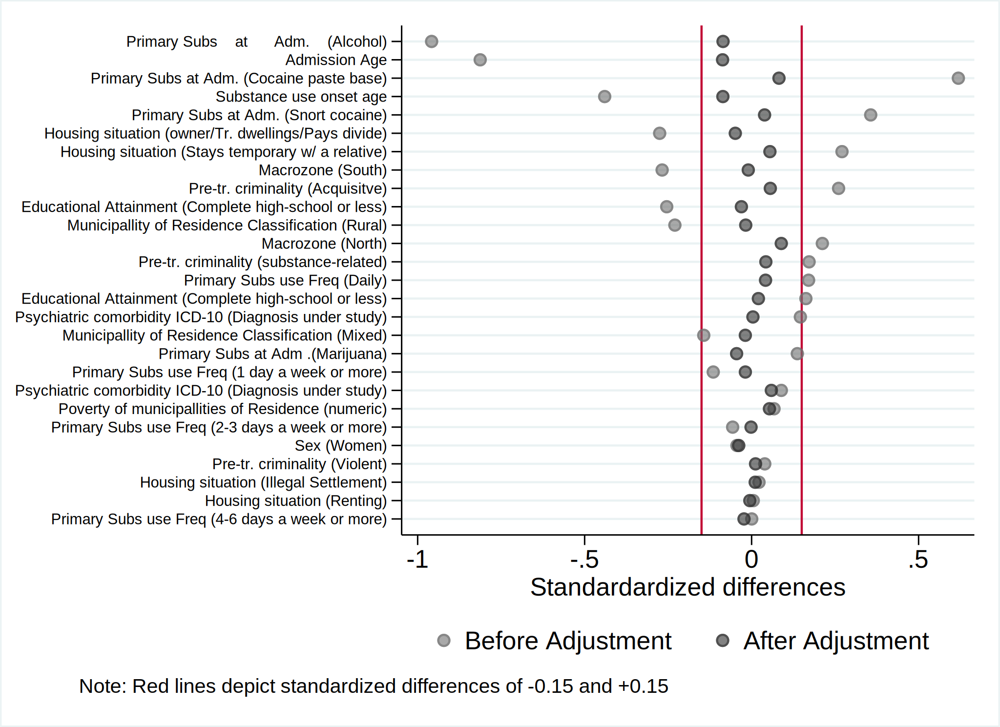
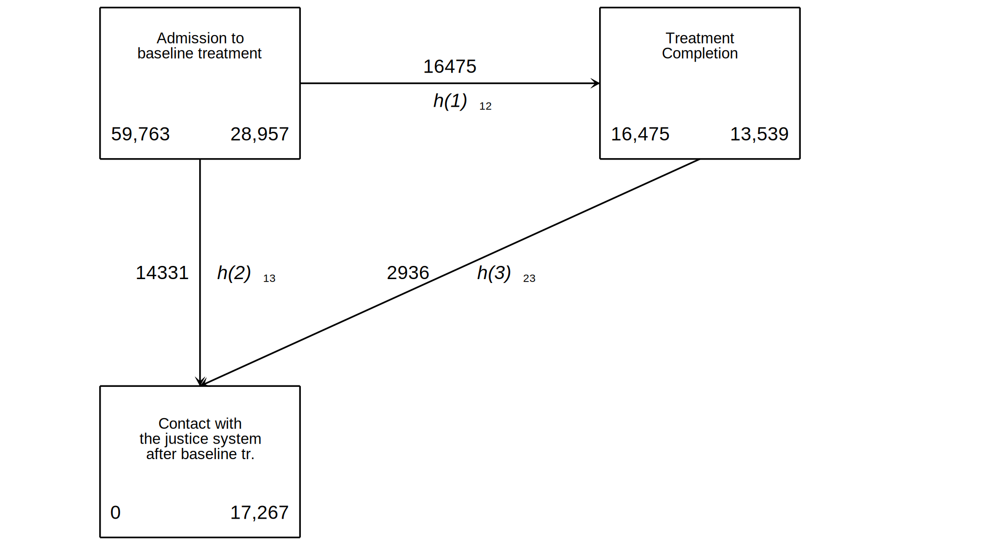

<!---
knit: pagedown::chrome_print    
#https://github.com/brentthorne/posterdown/wiki/posterdown_betterport
#despues de number_section
#knit: pagedown::chrome_print
#https://docs.google.com/document/d/1O9_FGXL4jDPn19yp4Pb6y0w0BZtbocMK90ee8Gz3FNg/edit#

https://github.com/brentthorne/posterdown/wiki/posterdown_html
--->

```{css, echo=FALSE}
div.title_container{
   background-image: linear-gradient(#ff7f50 8%, #21177A); /* background-color: #21177A;*/
}

div.logo_left{
  background-image: linear-gradient(#ff7f50 8%, #21177A);/* background-color: #ff7f50; */
}
div.logo_right{
  background-image: linear-gradient(#ff7f50 8%, #21177A); /*background-color: #ff7f50; */
}

:root {
  --text-bold-color: #21177A;
}


h3 {
  line-height: .65em !important;
  margin-top: 0 !important;
  margin-bottom: 0 !important;
  padding: 0px !important;
}

h5 {
  line-height: .65em !important;
  margin-top: 0 !important;
  margin-bottom: 0 !important;
  padding: 0px !important;
}

.poster_title h3 > sup {
  line-height: .65em !important;
  margin-top: 0 !important;
  margin-bottom: 0 !important;
  padding: 0px !important;
}
.poster_title h5 {
  line-height: .65em !important;
  margin-top: 0 !important;
  margin-bottom: 0 !important;
  padding: 0px !important;
}
.poster_title h2 {
  line-height: .65em !important;
  margin-top: 0 !important;
  margin-bottom: 0 !important;
  padding: 0px !important;
}

poster_title h3 > sup {
  line-height: .65em !important;
  margin-top: 0 !important;
  margin-bottom: 0 !important;
  padding: 0px !important;
}
poster_title h5 {
  line-height: .65em !important;
  margin-top: 0 !important;
  margin-bottom: 0 !important;
  padding: 0px !important;
}
poster_title h2 {
  line-height: .65em !important;
  margin-top: 0 !important;
  margin-bottom: 0 !important;
  padding: 0px !important;
}
/* gray #4a4a4a */
```

```{=html}
<style type="text/css">
.showopt {   
  background-color: #004c93;   color: #FFFFFF;    width: 100px;   height: 20px;   text-align: center;   vertical-align: middle !important;   float: right;   font-family: sans-serif;   border-radius: 8px; 
  }
/*  
@page {
  size: 1016mm 1066.8mm; 
  line-height: .85em !important;
  margin-top: 0 !important;
  margin-bottom: 0 !important;
  padding: 0px !important;
}  
title {
  line-height: .85em !important;
  margin-top: 0 !important;
  margin-bottom: 0 !important;
  padding: 0px !important;
}
author {
  line-height: .85em !important;
  margin-top: 0 !important;
  margin-bottom: 0 !important;
  padding: 0px !important;
}
affiliation {
  line-height: .85em !important;
  margin-top: 0 !important;
  margin-bottom: 0 !important;
  padding: 0px !important;
  font-style: italic;
}

.poster_title h5 {
  line-height: .5em !important;
  margin-top: 0 !important;
  margin-bottom: 0 !important;
  padding: 0px !important;
}


/* https://github.com/brentthorne/posterdown/issues/94  
p.caption {
 margin-top: 0;
 margin-bottom: 0;
}
/* for main author affiliation superscript
.affiliation {
  line-height: .85em !important;
  margin-top: 0 !important;
  margin-bottom: 0 !important;
  padding: 0px !important;
}
.author {
  line-height: .85em !important;
  margin-top: 0 !important;
  margin-bottom: 0 !important;
  padding: 0px !important;
}
.section h1 {
  font-weight: bold;
  background: none;
  line-height: .85em !important;
  margin-top: 0 !important;
  margin-bottom: 0 !important;
  padding: 0px !important;
}
.section h2 {
  font-weight: bold;
  background: none;
  line-height: .85em !important;
  margin-top: 0 !important;
  margin-bottom: 0 !important;
  padding: 0px !important;
}

.showopt:hover {     
        background-color: #dfe4f2;
        color: #004c93; 
        }  
pre.plot {   
        background-color: white !important; 
        } 
.tablelines table, .tablelines td, .tablelines th {
        border: 1px solid black;
        }

.centrado {
    text-align: center;
}

.table.center {
    margin-left:auto; 
    margin-right:auto;
  }

/* https://vivekjaiskumar.medium.com/css-is-and-not-selector-17c942ec83f :is()*/

/* Applies to outputs that are not code other than R*/

pre {
  overflow-x: auto !important;
}
pre code {
  word-wrap: normal !important;
  white-space: pre !important;
}
/*
pre:not(.sourceCode) { 
  white-space: nowrap !important;
}
*/
.sourceCode { /* Important gives precedence  */
  font-size: 10px !important;
  line-height: 50% !important;
}
.text_25 { /* Important gives precedence  */
  font-size: 25% !important;
}
.text_35 { /* Important gives precedence  */
  font-size: 35% !important;
  line-height: .85em !important;
  margin-top: 0 !important;
  margin-bottom: 0 !important;
  padding: 0px !important;
  grid-template-columns: repeat(2, 1fr) !important;
}

.text_38 { /* Important gives precedence  */
  font-size: 38% !important;
}

.text_40 { /* Important gives precedence  */
  font-size: 40% !important;
}


.text_45 { /* Important gives precedence  */
  font-size: 45% !important;
}

.text_50 { /* Important gives precedence  */
  line-height: .85em !important;
  margin-top: 0 !important;
  margin-bottom: 0 !important;
  padding: 0px !important;
  grid-template-columns: repeat(2, 1fr) !important;
  font-size: 50% !important;
}

.text_55 { /* Important gives precedence  */
  font-size: 55% !important;
}

.text_60 { /* Important gives precedence  */
  font-size: 60% !important;
}

.text_65 { /* Important gives precedence  */
  font-size: 65% !important;
}

.text_70 { /* Important gives precedence  */
  font-size: 70% !important;
}

.text_75 { /* Important gives precedence  */
  font-size: 75% !important;
}

body{ /* Normal  */
      text-align: justify !important;
      /* font-size: 90% !important; */
  }

.superbigimage{
    overflow-y:scroll;
    height:350px;
    white-space: nowrap;
    overflow-x: auto; 
    width:100%;
}
.superbigimage img{
    overflow-y: scroll;
    overflow-x: hidden;
}

.message { color:#446C6E; font-family: monospace;font-size: 10px; line-height: 110%; font-weight: bold;}
div.blue { background-color:#e6f0ff; border-radius: 5px; padding: 5px; text-align: justify;}
div.red { background-color:#e6bab1; border-radius: 5px; padding: 5px; text-align: justify;}

.pandoc-table { /* Should add !important; but it seems no necessary  */
  margin-left:auto; /* To center */
  margin-right:auto;
  border-collapse: collapse;
  table-layout: auto;
  font-size: 7px;
  overflow-y: auto;
  max-height:450px !important;
  white-space: nowrap;
  overflow-x: auto; 
  width:450px;
}

.pandoc-table th {/* header */
text-align: center !important;
font-size: 7px;
padding: 0px;
}

.pandoc-table td {
text-align: left !important;
font-size: 6px;
padding: 0px;
}

.pandoc-table caption {
    text-align: left !important;
    font-size: 11px !important;
}

.controlly{
    overflow-y:scroll;
    height:350px;
    overflow-x: scroll; 
}

ule {
  display: grid !important;
  grid-template-columns: repeat(2, 1fr) !important;
}

</style>

<style>
p.caption {
 margin-top: 0 !important;
 margin-bottom: 0 !important;
}
</style>

<style>
.showopt {
  background-color: #004c93;
  color: #FFFFFF; 
  width: 100px;
  height: 20px;
  text-align: center;
  vertical-align: middle !important;
  float: right;
  font-family: sans-serif;
  border-radius: 8px;
}

.showopt:hover {
    background-color: #dfe4f2;
    color: #004c93;
}

pre.plot {
  background-color: white !important;
}
</style>
```

```{js hideOutput, echo=F}
$(document).ready(function() {    
	$chunks = $('.fold');    
	$chunks.each(function () {      // add button to source code chunks     
	if ( $(this).hasClass('s') ) {       
		$('pre.r', this).prepend("<div class=\"showopt\">Show Source</div><br style=\"line-height:22px;\"/>");
       		$('pre.r', this).children('code').attr('class', 'folded');     
       		}      // add button to output chunks     
		if ( $(this).hasClass('o') ) {       
			$('pre:not(.r)', this).has('code').prepend("<div class=\"showopt\">Show Output</div><br style=\"line-height:22px;\"/>");       
			$('pre:not(.r)', this).children('code:not(r)').addClass('folded');        // add button to plots       
			$(this).find('img').wrap('<pre class=\"plot\"></pre>');       
			$('pre.plot', this).prepend("<div class=\"showopt\">Show Plot</div><br style=\"line-height:22px;\"/>");       
			$('pre.plot', this).children('img').addClass('folded');      
			}   
});    // hide all chunks when document is loaded   
	$('.folded').css('display', 'none')    // function to toggle the visibility   
	$('.showopt').click(function() {     
			var label = $(this).html();     
			if (label.indexOf("Show") >= 0) {       
				$(this).html(label.replace("Show", "Hide"));     
			} else {
			  $(this).html(label.replace("Hide", "Show"));     
			}     
	$(this).siblings('code, img').slideToggle('fast', 'swing');   
	}); 
}); 
```


```{r prev-setup, include = FALSE, cache=T, error=T}
rm(list=ls());gc()

#If you render multiple documents from the same script or R session, you should detach("Statamarkdown") in between documents.
try(detach("Statamarkdown"))

no_mostrar=1

if(no_mostrar==0){
if(!grepl("4.1.2",R.version.string)){stop("Different version (must be 4.1.2)")}
path<-getwd()#we define it again later in setup chunk
if (grepl("CISS Fondecyt",path)==T){
    try(setwd("C:/Users/CISS Fondecyt/Mi unidad/Alvacast/SISTRAT 2022 (github)"));load("C:/Users/CISS Fondecyt/Mi unidad/Alvacast/SISTRAT 2022 (github)/15.Rdata")
  } else if (grepl("andre",path)==T){
    try(setwd('C:/Users/andre/Desktop/SUD_CL/'));load("E:/Mi unidad/Alvacast/SISTRAT 2022 (github)/15.Rdata")
  } else if (grepl("E:",path)==T){
    try(setwd("E:/Mi unidad/Alvacast/SISTRAT 2022 (github)/SUD_CL/"));load("E:/Mi unidad/Alvacast/SISTRAT 2022 (github)/15.Rdata")
  } else {
    try(setwd(paste0(path)));load(paste0(gsub("SUD_CL","",gsub("2022","2019",path)),"/15.Rdata"))
  }
}
```


```{r setup, include = FALSE, cache=T, error=T, echo=T}
#Libraries used in the routine. Dont change the order
local({r <- getOption("repos")
       r["CRAN"] <- "http://cran.r-project.org" 
       options(repos=r)
})
copiar_nombres <- function(x,row.names=FALSE,col.names=TRUE,dec=",",...) {
  if(class(try(dplyr::ungroup(x)))[1]=="tbl_df"){
        if(options()$OutDec=="."){
            options(OutDec = dec)
            write.table(format(data.frame(x)),"clipboard",sep="\t",row.names=FALSE,col.names=col.names,...)
            options(OutDec = ".")
          return(x)
        } else {
            options(OutDec = ",")
            write.table(format(data.frame(x)),"clipboard",sep="\t",row.names=FALSE,col.names=col.names,...)
            options(OutDec = ",")
          return(x)    
        }
  } else {
        if(options()$OutDec=="."){
            options(OutDec = dec)
            write.table(format(x),"clipboard",sep="\t",row.names=FALSE,col.names=col.names,...)
            options(OutDec = ".")
          return(x)
        } else {
            options(OutDec = ",")
            write.table(format(x),"clipboard",sep="\t",row.names=FALSE,col.names=col.names,...)
            options(OutDec = ",")
          return(x)       
  }
 }
}  
pacman::p_unlock(lib.loc = .libPaths()) #para no tener problemas reinstalando paquetes

if(!require(pacman)){install.packages("pacman")}
if(!require(devtools)){install.packages("devtools", type = "win.binary", dependencies=T)}

pacman::p_load(APCtools, ggpattern, withr, boot, matrixStats, knitr, tidyr, stringi,stringr, ggplot2, Hmisc, kableExtra, plotly, janitor, rbokeh, zoo, broom, sqldf, devtools, codebook, data.table, panelr, RColorBrewer, lsmeans, finalfit, ggiraph, sf, treemapify, dplyr, tidyverse, epiR, survminer, survival, ggfortify, survMisc, foreign, reshape2, stargazer, tableone, MatchIt, cobalt, eha, igraph, Amelia, DiagrammeR, DiagrammeRsvg, rsvg, mstate, htmltools, webshot, flexsurv, muhaz, Metrics, rpivotTable, caret, polycor, ClusterR, flextable, ggstatsplot, ggside, daff, explore, sjPlot, compareGroups, job, missForest, showtext, ggpattern, distill, showtext, googleVis, tidylog, magick, dlookr, easystats, tidylog, sqldf,  adjustedCurves, ggpmisc, rms, rateratio.test, XML, RCurl, rlist, install=T)


#Error in if (options$noisey == TRUE) message(paste("\n", options$engine, : argument is of length zero


if(!require(survcomp)){try(devtools::install_github("bhklab/survcomp",upgrade ="never"))}

try(webshot::install_phantomjs())

if(!require(bpmn)){try(devtools::install_github("bergant/bpmn",upgrade ="never"))}

#if(!require(Statamarkdown)){try(devtools::install_github("Hemken/Statamarkdown",upgrade ="never"))}
# #Error in if (options$noisey == TRUE) message(paste("\n", options$engine,  : 
#   argumento tiene longitud cero
# Calls: <Anonymous> ... sew.list -> lapply -> FUN -> sew.character -> <Anonymous>

#easystats::install_suggested()

options(scipen=2) #display numbers rather scientific number

#remotes::install_github("chjackson/flexsurv-dev", upgrade = "never")
#devtools::install_github("hputter/mstate", upgrade = "never")

#:#:#:#:#:#:#:#:#:#:#:#:#:#:#:#:#:#:#:#:#:#:#:#:#:#:#:#:#:#:#:#:#:#:#:#:#:#:#:#:#:#:#:#:#:#:#:#:#:#:#:#:#:#:#:
#:#:#:#:#:#:#:#:#:#:#:#:#:#:#:#:#:#:#:#:#:#:#:#:#:#:#:#:#:#:#:#:#:#:#:#:#:#:#:#:#:#:#:#:#:#:#:#:#:#:#:#:#:#:#:

fitstats.flexsurvreg = function(x){
  ll = x$loglik
  aic = x$AIC
  k = length(x$coefficients)
  n = sum(x$data$m["(weights)"])
  aicc = aic + ((2 * k) * (k + 1) / (n - k - 1))
  bic = - 2 * ll + (k * log(n))
  data.frame(
   Df = k,
    "n2ll" = -2 * ll,
    AIC = aic,
    AICc = aicc,
    BIC = bic
  )
}
#:#:#:#:#:#:#:#:#:#:#:#:#:#:#:#:#:#:#:#:#:#:#:#:#:#:#:#:#:#:#:#:#:#:#:#:#:#:#:#:#:#:#:#:#:#:#:#:#:#:#:#:#:#:#:
#:#:#:#:#:#:#:#:#:#:#:#:#:#:#:#:#:#:#:#:#:#:#:#:#:#:#:#:#:#:#:#:#:#:#:#:#:#:#:#:#:#:#:#:#:#:#:#:#:#:#:#:#:#:#:


if(.Platform$OS.type == "windows") withAutoprint({
  memory.size()
  memory.size(TRUE)
  memory.limit()
})
memory.limit(size=56000)

path<-dirname(rstudioapi::getSourceEditorContext()$path)

options(knitr.kable.NA = '')

#:#:#:#:#:#:#:#:#:#:#:#:#:#:#:#:#:#:#:#:#:#:#:#:#:#:#:#:#:#:#:#:#:#:#:#:#:#:#:#:#:#:#:#:#:#:#:#:#:#:#:#:#:#:#:
#:#:#:#:#:#:#:#:#:#:#:#:#:#:#:#:#:#:#:#:#:#:#:#:#:#:#:#:#:#:#:#:#:#:#:#:#:#:#:#:#:#:#:#:#:#:#:#:#:#:#:#:#:#:#:

#to format rows in bold
format_cells <- function(df, rows ,cols, value = c("italics", "bold", "strikethrough")){

  # select the correct markup
  # one * for italics, two ** for bold
  map <- setNames(c("*", "**", "~~"), c("italics", "bold", "strikethrough"))
  markup <- map[value]  

  for (r in rows){
    for(c in cols){

      # Make sure values are not factors
      df[[c]] <- as.character( df[[c]])

      # Update formatting
      df[r, c] <- ifelse(nchar(df[r, c])==0,"",paste0(markup, gsub(" ", "", df[r, c]), markup))
    }
  }

  return(df)
}
#To produce line breaks in messages and warnings
knitr::knit_hooks$set(
   error = function(x, options) {
     paste('\n\n<div class="alert alert-danger">',
           gsub('##', '\n', gsub('^##\ Error', '**Error**', x)),
           '</div>', sep = '\n')
   },
   warning = function(x, options) {
     paste('\n\n<div class="alert alert-warning">',
           gsub('##', '\n', gsub('^##\ Warning:', '**Warning**', x)),
           '</div>', sep = '\n')
   },
   message = function(x, options) {
     paste('<div class="message">',
           gsub('##', '\n', x),
           '</div>', sep = '\n')
   }
)

 
irrs<-function(x, y="event", z="person_days",db){
  #x= variable que agrupa
  #y= evento explicado
  #z= person days
  #db= base de datos
  fmla <- as.formula(paste0(y,"~",x))
  fmla2 <- as.formula(paste0(z,"~",x))
assign(paste0("irr_",y,"_por_",x),
       rateratio.test::rateratio.test(
     x=as.numeric(xtabs(fmla, data=get(db)))[c(2,1)],
     n=as.numeric(xtabs(fmla, data=get(db)))[c(2,1)]
    )
   )
return(
  rateratio.test::rateratio.test(
     x=as.numeric(xtabs(fmla, data=get(db)))[c(2,1)],
     n=as.numeric(xtabs(fmla2, data=get(db)))[c(2,1)]
      )
    )
}
```

```{r, include=FALSE}
knitr::opts_chunk$set(echo = FALSE,
                      warning = FALSE,
                      tidy = FALSE,
                      message = FALSE,
                      fig.align = 'center',
                      out.width = "100%")
options(knitr.table.format = "html") 
```


```{r, load_refs, include=F, cache=FALSE}
library(RefManageR)
BibOptions(check.entries = FALSE,
           bib.style = "numeric",
           cite.style = "numeric",
           style = "text",
           super = TRUE,
           hyperlink = FALSE,
           first.inits = TRUE,
           max.names = TRUE,
           dashed = TRUE)

myBib <- ReadBib("_bibs/libreria_poly.txt", check = F,  .Encoding="latin1")

ser_2023_0<-rio::import("ser_2023_0.dta")
ser_2023_1<-rio::import("ser_2023_1.dta")

```

# Background

<li>Substance use disorders(SUD) often occur with criminality & contact with the justice system(CJS)</li>
<li>People with polysubstance use (PSU) has shown more contacts with the CJS.</li>
<li>Completing SUD treatment can help reducing the risk of contacts with the CJS, but not quite clear in people with PSU.</li>
<li>More research is needed to understand the link between PSU, treatment completion, and contact with the CJS, specially in Latin America.</li>

**Objectives**: Estimate the effects of PSU at baseline (vs. single substance use) on the probabilities of (i) completing baseline drug treatment and (ii) contacting with the CJS after treatment at 6 months, 1-, 3- & 5-years follow-ups.
<!--- **Hypothesis:** Baseline PSU is related to lower treatment completion rates (1), baseline PSU is linked to a greater risk of contact with CJS (2), patients with PSU will have a differential risk of contact with CJS associated with treatment completion, and treatment completion will explain part of the relationship between PSU and contact with CJS (3). --->

# Methods
**Design**: retrospective cohort based on the administrative data's record linkage. **Data**:  Chilean substance use treatment programs and Prosecutor’s Office through a deterministic linkage process. **Ethics**: We are updating an existing ethical approval by the Griffith University GU Ref No: 2022/919.

**Exposure**: baseline PSU (using >1 substance at admission to SUD treatment); **Mediator**: SUD treatment outcome (complete vs. dropout/spelled by misconduct); **Outcome**: contact with CJS (committing an offense that led to a condemnatory sentence).

<li>The research control for a number of confounding variables (listed in Figure 1), and patients are weighted by the inverse probability of PSU(IPW).</li>
<li>We described the cumulative incidence rate (x1,000 person-years) of patients with PSU and no PSU and incidence rate ratios(IRR) of treatment completion and contact with CJS, with and without  IPWs.</li>
```{r exp-surv4-plot, eval=T, echo=F, error=T, fig.align='center', fig.cap="Covariate balance", fig.retina=2}

```

<li>We used an illness-death multistate structure to estimate transitions from admission to treatment outcome, treatment outcome to contact with CJS, and admission to contact with CJS (not completing treatment) for patients with and without PSU (Figure 2).</li>
```{r exp-surv3-plot, eval=T, echo=F, error=T, fig.align='center', fig.cap="Multistate scheme", fig.retina=2}

```
We calculated the Aalen-Johansen for transition probabilities at 6 months, 1, 3 & 5 years.

# Preliminary Results

```{r exp-rates1, eval=T, echo=F, error=T, fig.align='center', message=FALSE, warning=FALSE}
invisible("Complete treatments, no weights, IRR")
irr_tr_comp_nowgt<-rvest::read_html("irrs_t0_nowgt_tr_comp.html") %>% rvest::html_table() %>% 
  data.frame() %>% dplyr::filter(nchar(X1)>2)
irr_tr_comp_nowgt<-cbind.data.frame(measure= irr_tr_comp_nowgt[seq(1,nrow(irr_tr_comp_nowgt),by=2),1], value=irr_tr_comp_nowgt[seq(2,nrow(irr_tr_comp_nowgt),by=2),1])
irr_tr_comp_nowgt$value<- stringr::str_replace_all(irr_tr_comp_nowgt$value, pattern = "(\\d)\\1{3,}", replacement = "\\1")
irr_tr_comp_nowgt$value<- stringr::str_replace_all(irr_tr_comp_nowgt$value, pattern = "(?<![0-9])\\.", replacement = "0.")
irr_tr_comp_nowgt$value[-4]<- stringr::str_replace_all(irr_tr_comp_nowgt$value[-4], pattern = "[()]", replacement = "")
irr_tr_comp_nowgt$value<- stringr::str_replace_all(irr_tr_comp_nowgt$value, "p=0.0$", "p<0.001")
irr_tr_comp_nowgt$value[1:2]<- #attr(sapply(irr_tr_comp_nowgt$value[1:2], process_string),"names")
stringr::str_replace_all(as.character(irr_tr_comp_nowgt$value[1:2]), 
                         pattern = "\\b(\\d+\\.\\d{2})\\d*\\b", 
                         function(x) sprintf("%1.1f", readr::parse_number(x)))

invisible("Complete treatments, weight(1), IRR")
irr_tr_comp_wgt<-rvest::read_html("irrs_t0_wgt_tr_comp.html") %>% rvest::html_table() %>%  data.frame() %>% dplyr::filter(nchar(X1)>2)
irr_tr_comp_wgt<-cbind.data.frame(measure= irr_tr_comp_wgt[seq(1,nrow(irr_tr_comp_wgt),by=2),1], value=irr_tr_comp_wgt[seq(2,nrow(irr_tr_comp_wgt),by=2),1])
irr_tr_comp_wgt$value<- stringr::str_replace_all(irr_tr_comp_wgt$value, pattern = "(\\d)\\1{3,}", replacement = "\\1")
irr_tr_comp_wgt$value<- str_replace_all(irr_tr_comp_wgt$value, pattern = "(?<![0-9])\\.", replacement = "0.")
irr_tr_comp_wgt$value[-4]<- stringr::str_replace_all(irr_tr_comp_wgt$value[-4], pattern = "[()]", replacement = "")
irr_tr_comp_wgt$value<- stringr::str_replace_all(irr_tr_comp_wgt$value, "p=0.0$", "p<0.001")
irr_tr_comp_wgt$value<- stringr::str_replace_all(irr_tr_comp_wgt$value, pattern = "\\b(\\d+\\.\\d{2})\\d+\\b", function(x) round(as.numeric(x), 1))
irr_tr_comp_wgt$value[1:2]<- 
stringr::str_replace_all(stringr::str_replace_all(as.character(irr_tr_comp_wgt$value[1:2]), pattern =  "\\d+\\.?\\d*", function(x) sprintf("%1.1f", readr::parse_number(x))), "95.0%CI","95%CI")

invisible("Complete treatments, weight(2), IRR")
irr_tr_comp_wgt2<-rvest::read_html("irrs_t0_wgt_tr_comp2.html") %>% rvest::html_table() %>%  data.frame() %>% dplyr::filter(nchar(X1)>2)
irr_tr_comp_wgt2<-cbind.data.frame(measure= irr_tr_comp_wgt2[seq(1,nrow(irr_tr_comp_wgt2),by=2),1], value=irr_tr_comp_wgt2[seq(2,nrow(irr_tr_comp_wgt2),by=2),1])
irr_tr_comp_wgt2$value<- stringr::str_replace_all(irr_tr_comp_wgt2$value,"\'","")
irr_tr_comp_wgt2$value<- str_replace_all(irr_tr_comp_wgt2$value, pattern = "(?<![0-9])\\.", replacement = "0.")

invisible("Contact with the justice system, no weight, IRR")
irr_cont_js_nowgt<-rvest::read_html("irrs_t0_nowgt_contact_js.html") %>% rvest::html_table() %>%  data.frame() %>% dplyr::filter(nchar(X1)>2)
irr_cont_js_nowgt<-cbind.data.frame(measure= irr_cont_js_nowgt[seq(1,nrow(irr_cont_js_nowgt),by=2),1], value=irr_cont_js_nowgt[seq(2,nrow(irr_cont_js_nowgt),by=2),1])
irr_cont_js_nowgt$value<- stringr::str_replace_all(irr_cont_js_nowgt$value, pattern = "(\\d)\\1{3,}", replacement = "\\1")
irr_cont_js_nowgt$value<- stringr::str_replace_all(irr_cont_js_nowgt$value, pattern = "(?<![0-9])\\.", replacement = "0.")
irr_cont_js_nowgt$value<- stringr::str_replace_all(irr_cont_js_nowgt$value, pattern = "[()]", replacement = "")
irr_cont_js_nowgt$value<- stringr::str_replace_all(irr_cont_js_nowgt$value, "p=0.0$", "p<0.001")
irr_cont_js_nowgt$value[1:2]<- 
stringr::str_replace_all(stringr::str_replace_all(as.character(irr_cont_js_nowgt$value[1:2]), pattern =  "\\d+\\.?\\d*", function(x) sprintf("%1.1f", readr::parse_number(x))), "95.0%CI","95%CI")

invisible("Contact with the justice system, weight(1), IRR")
irr_cont_js_wgt<-rvest::read_html("irrs_t0_wgt_contact_js.html") %>% rvest::html_table() %>%  data.frame() %>% dplyr::filter(nchar(X1)>2)
irr_cont_js_wgt<-cbind.data.frame(measure= irr_cont_js_wgt[seq(1,nrow(irr_cont_js_wgt),by=2),1], value=irr_cont_js_wgt[seq(2,nrow(irr_cont_js_wgt),by=2),1])
irr_cont_js_wgt$value[1:2]<- 
stringr::str_replace_all(stringr::str_replace_all(as.character(irr_cont_js_wgt$value[1:2]), pattern =  "\\d+\\.?\\d*", function(x) sprintf("%1.1f", readr::parse_number(x))), "95.0%CI","95%CI")
irr_cont_js_wgt$value[-4]<- stringr::str_replace_all(irr_cont_js_wgt$value[-4], pattern = "[()]", replacement = "")
irr_cont_js_wgt$value<- stringr::str_replace_all(irr_cont_js_wgt$value, "p=0.0000", "p<0.001")

invisible("Contact with the justice system, weight(2), IRR")
irr_cont_js_wgt2<-rvest::read_html("irrs_t0_wgt_contact_js2.html") %>% rvest::html_table() %>%  data.frame() %>% dplyr::filter(nchar(X1)>2)
irr_cont_js_wgt2<-cbind.data.frame(measure= irr_cont_js_wgt2[seq(1,nrow(irr_cont_js_wgt2),by=2),1], value=irr_cont_js_wgt2[seq(2,nrow(irr_cont_js_wgt2),by=2),1])
irr_cont_js_wgt2$value<- stringr::str_replace_all(irr_cont_js_wgt2$value,"\'","")
irr_cont_js_wgt2$value<- stringr::str_replace_all(irr_cont_js_wgt2$value, "p=0.0000", "p<0.001")

tab_irrs<-
cbind.data.frame(trans=rep(c("Tr. completion","Contact with the CJS"),2),
                 wgt=rep(c("Before weights","After weights"),each=2),
                 IRRs=c(irr_tr_comp_nowgt$value[which(irr_tr_comp_nowgt$measure=="IRR")],
                       irr_cont_js_nowgt$value[which(irr_cont_js_nowgt$measure=="IRR")],
                       irr_tr_comp_wgt$value[which(irr_tr_comp_wgt$measure=="IRR")],
                       irr_cont_js_wgt$value[which(irr_cont_js_wgt$measure=="IRR")]))
```

- **Before IPWs** patients with PSU had lower rates of treatment completion (IRR=`r irr_tr_comp_nowgt$value[which(irr_tr_comp_nowgt$measure=="IRR")]`) and greater rates of contact with the CJS vs. patients with no PSU (IRR=`r irr_cont_js_nowgt$value[which(irr_cont_js_nowgt$measure=="IRR")]`).

-	**After IPWs**: patients with PSU had lower rates of treatment completion (IRR=`r irr_tr_comp_wgt$value[which(irr_tr_comp_wgt$measure=="IRR")]`) but greater rates of contact with the CJS vs. patients with no PSU (IRR=`r irr_cont_js_wgt$value[which(irr_cont_js_wgt$measure=="IRR")]`).

```{r exp-surv23-2, eval=T, echo=F, error=T, fig.align='center', message=FALSE, warning=FALSE}
#Before IPWs, patients with PSU had lower incidence rates of treatment completion vs. patients with no PSU (IRR=0.53 95%CI: 0.51,0.54). However, patients with PSU had  (IRR=1.68 95%CI: 1.62,1.74).After IPWs, patients with PSU still had lower rates of treatment completion vs. patients with no PSU (IRR=0.77 95%CI: 0.74,0.8) Patients with PSU also had greater rates of contact with the CJS vs. patients with no PSU (IRR=1.11 95%CI: 1.06,1.17)
prob_direct<-rvest::read_html("pr_msaj13_23.html") %>% rvest::html_table()
prob_indirect1<-rvest::read_html("pr_msaj12_23.html") %>% rvest::html_table()
prob_indirect2<-rvest::read_html("pr_msaj23_23.html") %>% rvest::html_table()

prob_direct<-
prob_direct %>% as.data.table() %>% dplyr::mutate_at(c("X6","X7"),~paste0(.,"_")) %>%  janitor::row_to_names(3) %>% 
  dplyr::rename("Time" = 1) %>% slice(2:5) %>% mutate(PSU= paste0(Est_Poly," (", LCI_,",",UCI_,")"), NoPSU = paste0(Est_NoPoly," (", LCI,",",UCI,")")) %>% 
  dplyr::select(Time, PSU, NoPSU) %>% 
  dplyr::mutate(PSU= stringr::str_replace_all(PSU, "_", "")) %>% 
  dplyr::mutate_at(c("PSU", "NoPSU"), ~stringr::str_replace_all(., pattern =  "\\b\\d+\\.?\\d*\\b", function(x) sprintf("%.1f", as.numeric(x))))

prob_indirect1<-
prob_indirect1 %>% as.data.table() %>% dplyr::mutate_at(c("X6","X7"),~paste0(.,"_")) %>%  janitor::row_to_names(3) %>% 
  dplyr::rename("Time" = 1) %>% slice(2:5) %>% mutate(PSU= paste0(Est_Poly," (", LCI_,",",UCI_,")"), NoPSU = paste0(Est_NoPoly," (", LCI,",",UCI,")")) %>% 
  dplyr::select(Time, PSU, NoPSU) %>% 
  dplyr::mutate(PSU= stringr::str_replace_all(PSU, "_", "")) %>% 
  dplyr::mutate_at(c("PSU", "NoPSU"), ~stringr::str_replace_all(., pattern =  "\\b\\d+\\.?\\d*\\b", function(x) sprintf("%.1f", as.numeric(x))))

prob_indirect2<-
prob_indirect2 %>% as.data.table() %>% dplyr::mutate_at(c("X6","X7"),~paste0(.,"_")) %>%  janitor::row_to_names(3) %>% 
  dplyr::rename("Time" = 1) %>% slice(2:5) %>% mutate(PSU= paste0(Est_Poly," (", LCI_,",",UCI_,")"), NoPSU = paste0(Est_NoPoly," (", LCI,",",UCI,")")) %>% 
  dplyr::select(Time, PSU, NoPSU) %>% 
  dplyr::mutate(PSU= stringr::str_replace_all(PSU, "_", "")) %>% 
  dplyr::mutate_at(c("PSU", "NoPSU"), ~stringr::str_replace_all(., pattern =  "\\b\\d+\\.?\\d*\\b", function(x) sprintf("%.1f", as.numeric(x))))
trans_prob_tab<-
bind_rows(cbind.data.frame(trans=rep("From admission to contact with CJS",),prob_direct), 
          cbind.data.frame(trans=rep("From admission to tr.completion",),prob_indirect1),
          cbind.data.frame(trans=rep("From tr.completion to contact with CJS",),prob_indirect2)) 

kbl(trans_prob_tab,format = 'html',
        escape = FALSE,
        col.names= c("Transition", "Time", "PSU", "No PSU"), 
    caption= "Transition probabilities in states") %>% 
    kable_styling(font_size = 26) %>%
    gsub("font-size: initial !important;", 
         "font-size: 26pt !important;", 
         .) %>% 
  row_spec(1:nrow(bind_rows(cbind.data.frame(trans=rep("From admission to contact with CJS",),prob_direct), 
          cbind.data.frame(trans=rep("From admission to tr.completion",),prob_indirect1),
          cbind.data.frame(trans=rep("From tr.completion to contact with CJS",),prob_indirect2))), extra_css = "padding: 1.3px")#%>%
  #kable_styling(full_width = FALSE, position = "right")
```

```{r, eval=F}
kbl(tab_irrs,format = 'html',
        escape = FALSE,
        col.names= c("Event", "IPW", "IRR"),
    caption= "Incidence rate ratios by event") %>%
    kable_styling(font_size = 26) %>%
    gsub("font-size: initial !important;",
         "font-size: 26pt !important;",
         .) %>%
  row_spec(1:nrow(tab_irrs), extra_css = "padding: 1.3px")%>%
  kable_styling(full_width = FALSE, position = "float_left")

kbl(trans_prob_tab,format = 'html',
        escape = FALSE,
        col.names= c("Transition", "Time", "PSU", "No PSU"), 
    caption= "Transition probabilities in states") %>% 
    kable_styling(font_size = 26) %>%
    gsub("font-size: initial !important;", 
         "font-size: 26pt !important;", 
         .) %>% 
  row_spec(1:nrow(bind_rows(cbind.data.frame(trans=rep("From admission to contact with CJS",),prob_direct), 
          cbind.data.frame(trans=rep("From admission to tr.completion",),prob_indirect1),
          cbind.data.frame(trans=rep("From tr.completion to contact with CJS",),prob_indirect2))), extra_css = "padding: 1.3px")%>%
  kable_styling(full_width = FALSE, position = "right")
```

**Transition probabilities**: People with PSU have higher probabilities of contact with the CJS, both post-admission and post-treatment, vs. those without PSU. Similarly, they are less likely to complete treatment. Treatment completers had lower probabilities of CJS contact vs. non-completers after 3 years since admission. 

Codes & markdowns: https://fondecytacc.github.io/nDP/index_prop_grant23_24

# Discussion
Treatment completion can reduce the risk of criminal justice involvement, evident at the 3-year point when most users have finished treatment. Further analysis is needed. People with PSU may need enhanced treatment to complete treatments and avoid contact with the CJS.

::: text_70 
**Funding sources**: This work was funded by ANID -Millennium Science Initiative Program- N° NCS2021_003 (Castillo-Carniglia) and N° NCS2021_013 (Calvo); The authors have no conflict of interest to declare
:::